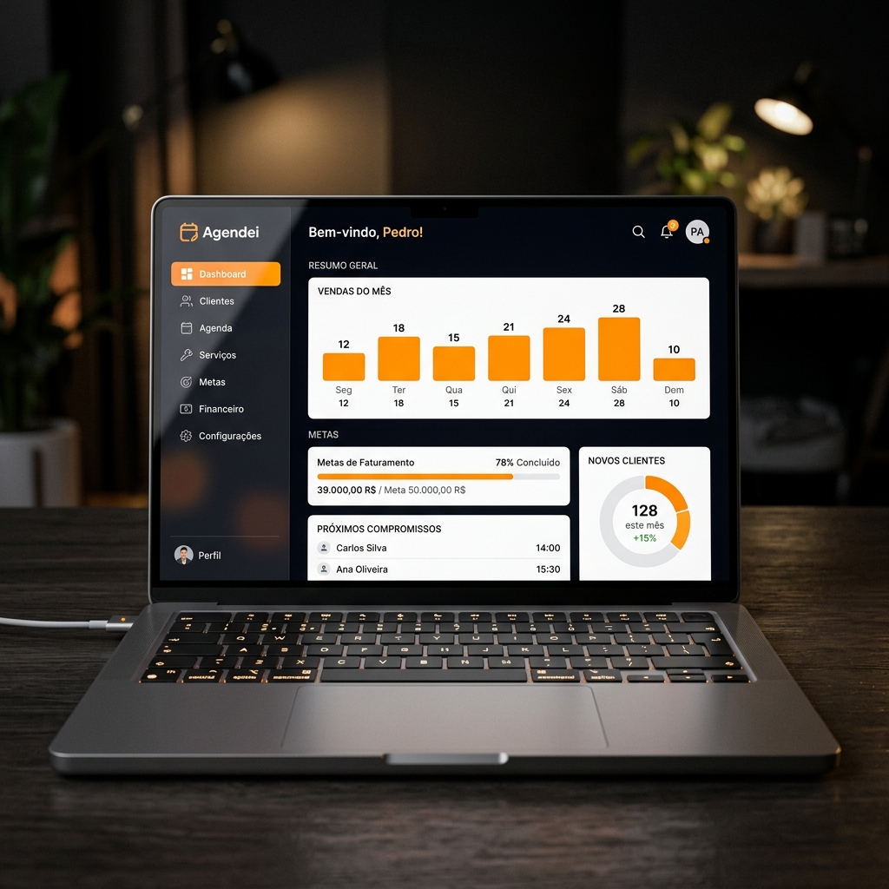

# 💈 Agendei. Landing Page — Showcase 2026

Bem-vindo ao repositório oficial da Landing Page do **Agendei.**, a plataforma definitiva para gestão inteligente de barbearias e salões de beleza.

## 🚀 O Projeto

Este repositório contém o código-fonte do site institucional/vitrine do Agendei. O objetivo desta página é apresentar os recursos premium da plataforma, suas integrações e a visão tecnológica por trás do produto.

### ✨ Funcionalidades em Destaque
- **Interface de Elite**: Design totalmente focado em Dark Mode com a paleta oficial `#fd9602` (Laranja Agendei).
- **Animações Cinematográficas**: Experiência de scroll imersiva construída com **GSAP (GreenSock)**.
- **Responsividade Total**: Mockups adaptados para Desktop e Mobile.
- **Ecossistema de Integrações**: Vitrine técnica mostrando a stack (Supabase, Firebase, Google, WhatsApp).

## 🛠️ Tecnologias Utilizadas

A stack foi escolhida para garantir performance máxima e carregamento instantâneo:

- **HTML5 & CSS3** (Custom Properties)
- **Tailwind CSS** (Estilização Utilitária de alta velocidade)
- **GSAP (GreenSock)** (Animações de ScrollTrigger e Parallax)
- **Lucide Icons** (Ícones vetoriais modernos)
- **Google Fonts** (Plus Jakarta Sans)

## 🌐 Acesso ao Produto

Você pode acessar a versão Alpha funcional do dashboard através do link abaixo:
👉 [https://agendei-alpha.vercel.app](https://agendei-alpha.vercel.app)

---

## 👨‍💻 Desenvolvedores & Criadores

- **Matheus Lucindo** — Visionário e Desenvolvedor Principal do Ecossistema Agendei.

---

## 📄 Licença

Este projeto é de uso exclusivo da organização **Agendei.-Barbearia-e-Salao-de-Beleza**. Todos os direitos reservados 2026.
